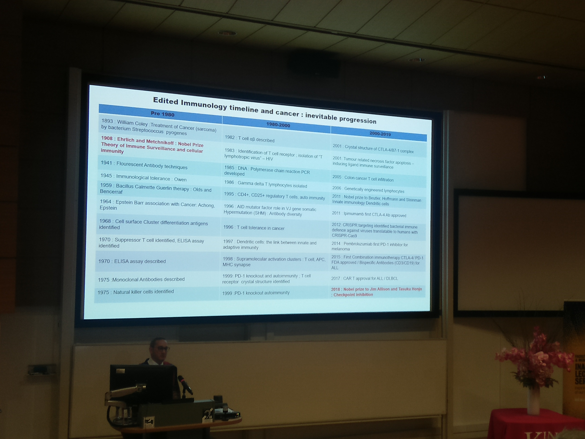
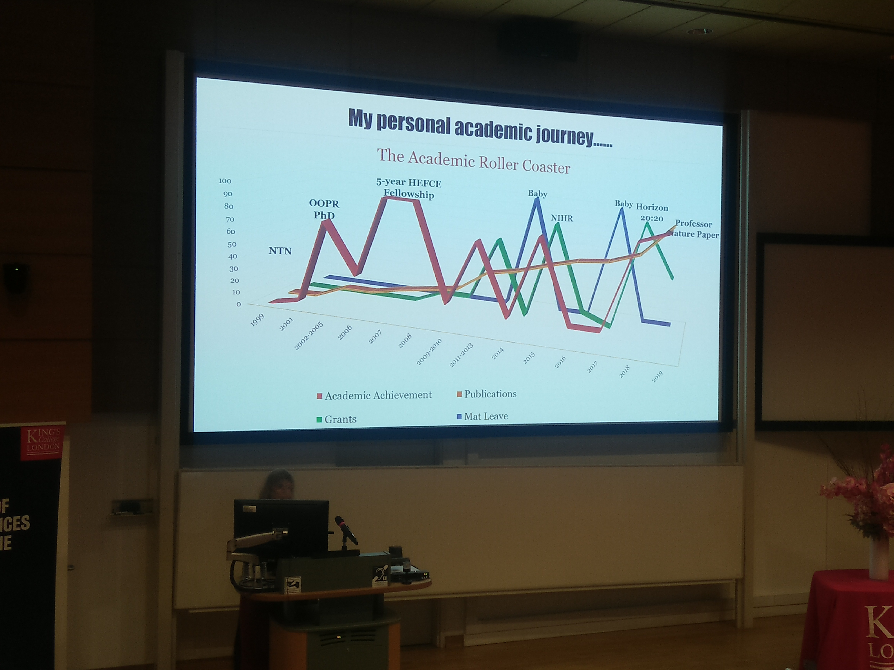

# Inaugural Lecture: Professors Debbie Shawcross and Paul Fields

## Date And Time
Wed, 26 February 2020  
17:30 – 20:00 GMT  

## Location
Lecture Theatre 1, New Hunt's House  
Guy's Campus  
King's College London  
SE1 1UL  

## Professor Paul Fields

> The life of a lymphomaniac: subverting the normal and abnormal immune response

The human immune system has evolved with a normal function to distinguish between self and non-self. This protects the body from external threats such as micro-organisms, but also from harmful changes which originate within the body, such as the malignant transformation of a normal cell into a cancer cell, or the introduction of new molecules that are perceived as non-self. This lecture will highlight the impact that Professor Fields has had on patients with genetic diseases, which are now curable by a gene-based approach, but requires suppression of the immune response to achieve efficacy. Professor Fields will also highlight how clinical trials have optimised treatment for Lymphoma patients (a tumour of the immune system and the fifth most common cancer in the UK), particularly for those unable to receive conventional therapies due to the presence of attendant comorbid conditions.

Extra references: 
* http://www.londonbridgehospital.com/LBH/consultant-det/dr-paul-fields/ 
* https://www.youtube.com/watch?v=1GCjtptLqnA 
* https://www.hcahealthcare.co.uk/consultants/f/paul-fields  

## Professor Debbie Shawcross

> When the diseased liver disrupts the brain

Chronic liver disease is increasing exponentially in the UK. 80% of patients with advanced chronic liver disease develop a syndrome called hepatic encephalopathy, whereby toxins such as ammonia are not cleared by the liver and disturb brain functioning. Patients develop debilitating dementia-like symptoms with poor prognosis. This lecture will take the audience on a journey beginning in 1893 when Pavlov’s Nobel Prize winning team first described hepatic encephalopathy as “the meat intoxication syndrome” resulting from excess ammonia. A century later, infection and inflammation were shown to be important in exaggerating the effects of ammonia on the brain. Patients with chronic liver disease have abnormal gut bacteria and a disrupted immune system predisposing to infections and encephalopathy. Professor Shawcross will demonstrate how modifying the gut microbiome has dramatically improved the outcomes for these patients.

Extra references: 
* https://twitter.com/DebbieShawcros1
* https://www.kcl.ac.uk/people/debbie-shawcross 
* https://kclpure.kcl.ac.uk/portal/debbie.shawcross.html  
* https://en.wikipedia.org/wiki/Ivan_Pavlov 

## References 
https://www.eventbrite.co.uk/e/inaugural-lecture-professors-debbie-shawcross-and-paul-fields-tickets-84729234421

